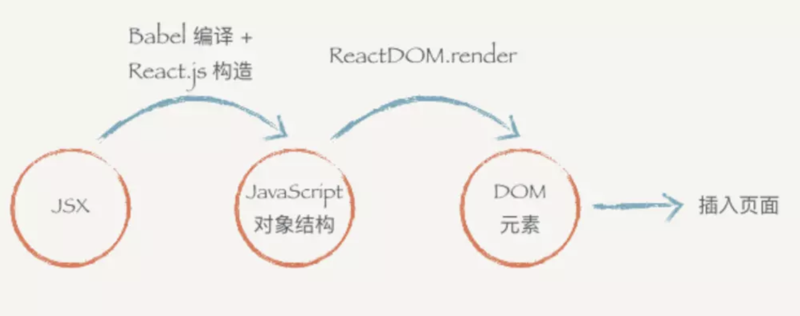

### 什么是 jsx

jsx 是 JavaScript 的语法糖

利用 HTML 语法来创建虚拟 DOM



### 为什么用 jsx

使用 React，不一定非要使用 JSX 语法，可以使用原生的 JS 进行开发

但是 React 作者强烈建议我们使用 jsx，因为：

- jsx 在定义类似 HTML 这种树形结构时，十分的简单明了
- 简明的代码结构更利于开发和维护
- XML 有着开闭标签，在构建复杂的树形结构时，比函数调用和对象字面量更易读

**babel 转换之后的 jsx**

example1:
```
<div id="div" key="key">
  <span>1</span>
  <span>2</span>
</div>
```
转换之后：
```
"use strict";

/*#__PURE__*/
React.createElement("div", {
  id: "div",
  key: "key"
}, /*#__PURE__*/React.createElement("span", null, "1"), /*#__PURE__*/React.createElement("span", null, "2"));
```
example2:
```
function Cmp() {
  return <a>123</a>
}

<Cmp id="div" key="key">
  <span>1</span>
  <span>2</span>
</Cmp>
```
转换之后：
```
function Cmp() {
  return /*#__PURE__*/React.createElement("a", null, "123");
}

/*#__PURE__*/
React.createElement(Cmp, {
  id: "div",
  key: "key"
}, /*#__PURE__*/React.createElement("span", null, "1"), /*#__PURE__*/React.createElement("span", null, "2"));
```
example3:

现在把 Cmp 改成 cmp

转换之后：
```
function cmp() {
  return /*#__PURE__*/React.createElement("a", null, "123");
}

/*#__PURE__*/
React.createElement("cmp", {
  id: "div",
  key: "key"
}, /*#__PURE__*/React.createElement("span", null, "1"), /*#__PURE__*/React.createElement("span", null, "2"));
```

**注意：在 React 插件里面，在转换过程中，是通过首字母是否大小写来决定翻译成字符串还是一个变量组件。如果是字符串的话，React 会把它翻译成一个 DOM 节点。所以，我们自定义的组件必须大写开头**